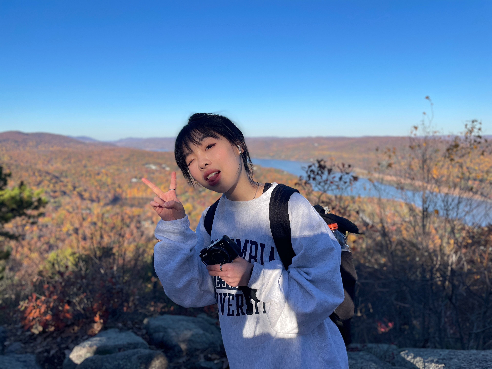

Hi, I&apos;m Yeque. You can call me Sissi!  

### About Sissi Sun

I am a passionate second-year MPH student in [Environmental Health Science](https://www.publichealth.columbia.edu/academics/degrees/master-public-health/columbia-mph/masters-public-health-environmental-health-sciences/) with certificate in [Applied Biostatistics and Public Health Data Science](https://www.publichealth.columbia.edu/become-student/degrees/masters-programs/masters-public-health/columbia-mph/certificates/applied) at [Columbia University](https://www.columbia.edu/).  

Environmental health and safety, data analysis, cancer research and epidemiological studies are some of my key interests. I also am proficient with R/SAS/QGIS, with a sufficient understanding of statistical analysis, geographic mapping, and data visualization.

 

### Contact Me
Yeque Sun  
Email: [sissi.sun0123@gmail.com](mailto:sissi.sun0123@gmail.com)  
Phone: +(1)212-380-7559

 

### Go to Other Pages

* [About](sissi.html)

* [Resume](experience.html)

* [Projects](plotly.html)
