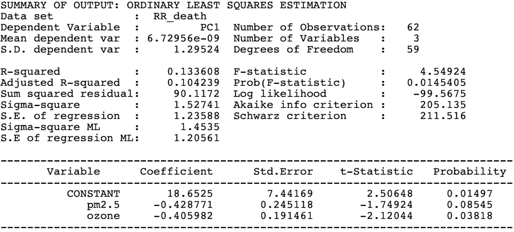

 

# {.tabset}

## **Assessing the Association between Air Pollution and Asthma by County in New York State, 2020**

 

### **Background**

Air pollution has grown in New York as a result of industrialization and growing urbanization. As the respiratory system is the first organ affected negatively by air pollution, exposure to high levels of pollutants can make respiratory illnesses worse. Children in New York State had an even greater frequency, with an 8.7% prevalence in 2014 rising to 10.0% in 2015, with the largest burden in New York City. According to previous studies on asthma, air pollution may make the condition more common. Visually displaying asthma (asthma hospitalization, asthma emergency department visits, and asthma death rate) by county among residents of New York in 2020 can offer insight for interventions and policies seeking to address air pollution hazards (fine particulate matter (PM2.5) and ozone (O3)) affecting public health in the United States.

 

### **Methods**

*Data Source:*  Data on air pollutants, asthma, and population in 2020 were all sourced from the EPA Air Data,  New York State Department of Health, and the United States’ Census Bureau respectively.
 
*Methods:* Asthma and air pollutant data by county level were collected and joined using QGIS software.

 
*  Air pollution parameters were considered independent modeling variables, using spatial interpolation and zonal statistics.
*  Spatial clusters were mapped and analyzed in QGIS to visualize results.
Second, I linked air pollutant mean concentration to asthma rate by county level.
*  Asthma disadvantage index was conducted to adjust three asthma rates; then using Geoda run the regression analysis.
*  Bivariate Local Moran’s I analyses were run using Geoda software to determine clustering in asthma death rate.

 

### **Results and Discussions**

  
  <figcaption><b>Map 1.</b>County-level air pollutants and asthma rate
</figcaption>

 

  
  <figcaption><b>Map 2.</b>Asthma disadvantage index</figcaption>

 

  
  <figcaption><b>Table 1.</b> Regression analysis on asthma disadvantage index and pm2.5/ozone</figcaption>

 

  
  <figcaption><b>Map 3.</b> Spatially significant clusters of excess death rate and pm2.5/ozone</figcaption>

 

*  Direct inspection of determinant maps reveals disparities in the geographical distribution of the various determinants, with moderately strong clustering between regions of high PM2.5/ozone distribution and high asthma prevalence.
*  Pm2.5/ozone determinants account for approximately 13% of the variation in crude prevalence of asthma.
*  There is significant spatial clustering regarding the spatial variation of pm2.5/ozone on excess asthma death rate (RR), although the Moran’s I value were both weak (pm2.5: 0.339, p-value= 0.001; ozone: 0.2974, p-value = 0.001). 
*  Ozone level was statistically significantly associated with excess asthma death rate (p-value = 0.038).

 

### **Limitations**

*  For evenly distributed geographical data in the research region, the interpolation methodology provides improved pollution level prediction. However, the pollution monitoring stations in New York State were not evenly distributed, which might contribute to some forecast inaccuracies.
*  One significant limitation of the health data used in this research is that asthma hospitalization records only indicate the number of asthma cases, not the severity of the asthma condition.
*  I selected the yearly average level of pollutants at a certain site as the population's exposure level, but the workplace was not at the same location, which might lead to bias in an individual's exposure assessment, influencing the results.

 

### **Conclusion**

*  There is significant spatial clustering of pm2.5/ozone level on asthma prevalence, although the spatial correlation was weak. 
*  The effect of specific air pollutants on asthma rate is yet to be examined for a plausible conclusion. 
*  Further study should also consider the socioeconomic factors and climatic factors for better reflection.

 

### **References**

1. Chang, Qing, et al. "Association between air pollutants and outpatient and emergency hospital visits for childhood asthma in Shenyang city of China." *International Journal of Biometeorology* 64.9 (2020): 1539-1548.
2. Khreis, Haneen, et al. "Exposure to traffic-related air pollution and risk of development of childhood asthma: a systematic review and meta-analysis." *Environment international* 100 (2017): 1-31.
3. Marino, Elisa, et al. "Impact of air quality on lung health: myth or reality?." *Therapeutic Advances in Chronic Disease* 6.5 (2015): 286-298.
New York State Asthma Dashboard. Accessed Nov 20. https://webbi1.health.ny.gov/SASStoredProcess/guest?_program=/EBI/PHIG/apps/asthma_dashboard/ad_dashboard&p=sh
  

 

### **Final Deliverable**

[Download the Poster](./images/poster.pdf)