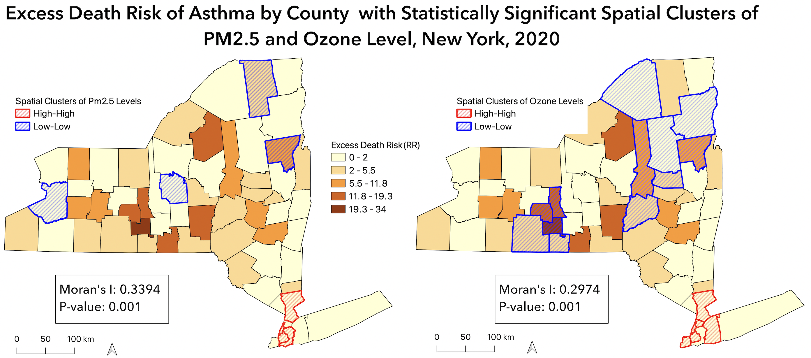

 

# {.tabset}

## **Assessing the Association between Air Pollution and Asthma by County in New York State,2020**

 

### **Background**

Air pollution has grown in New York as a result of industrialization and growing urbanization. As the respiratory system is the first organ affected negatively by air pollution, exposure to high levels of pollutants can make respiratory illnesses worse. Children in New York State had an even greater frequency, with an 8.7% prevalence in 2014 rising to 10.0% in 2015, with the largest burden in New York City. According to previous studies on asthma, air pollution may make the condition more common. Visually displaying asthma (asthma hospitalization, asthma emergency department visits, and asthma death rate) by county among residents of New York in 2020 can offer insight for interventions and policies seeking to address air pollution hazards (fine particulate matter (PM2.5) and ozone (O3)) affecting public health in the United States.

 

### **Methods**

*Data Source:*  Data on air pollutants, asthma, and population in 2020 were all sourced from the EPA Air Data,  New York State Department of Health, and the United States’ Census Bureau respectively.
 
*Methods:* Asthma and air pollutant data by county level were collected and joined using QGIS software.

 
*  Air pollution parameters were considered independent modeling variables, using spatial interpolation and zonal statistics.
*  Spatial clusters were mapped and analyzed in QGIS to visualize results.
Second, I linked air pollutant mean concentration to asthma rate by county level.
*  Asthma disadvantage index was conducted to adjust three asthma rates; then using Geoda run the regression analysis.
*  Bivariate Local Moran’s I analyses were run using Geoda software to determine clustering in asthma death rate.

 

### **Results and Discussions**

  
  <figcaption><b>Map 1.</b>County-level air pollutants and asthma rate
</figcaption>

 

  
  <figcaption><b>Map 2.</b>Asthma disadvantage index</figcaption>

 

  
  <figcaption><b>Table 1.</b> Regression analysis on asthma disadvantage index and pm2.5/ozone</figcaption>

 

  
  <figcaption><b>Map 3.</b> Spatially significant clusters of excess death rate and pm2.5/ozone</figcaption>

 

*  Direct inspection of determinant maps reveals disparities in the geographical distribution of the various determinants, with moderately strong clustering between regions of high PM2.5/ozone distribution and high asthma prevalence.
*  Pm2.5/ozone determinants account for approximately 13% of the variation in crude prevalence of asthma.
*  There is significant spatial clustering regarding the spatial variation of pm2.5/ozone on excess asthma death rate (RR), although the Moran’s I value were both weak (pm2.5: 0.339, p-value= 0.001; ozone: 0.2974, p-value = 0.001). 
*  Ozone level was statistically significantly associated with excess asthma death rate (p-value = 0.038).

 

### **Limitations**

*  For evenly distributed geographical data in the research region, the interpolation methodology provides improved pollution level prediction. However, the pollution monitoring stations in New York State were not evenly distributed, which might contribute to some forecast inaccuracies.
*  One significant limitation of the health data used in this research is that asthma hospitalization records only indicate the number of asthma cases, not the severity of the asthma condition.
*  I selected the yearly average level of pollutants at a certain site as the population's exposure level, but the workplace was not at the same location, which might lead to bias in an individual's exposure assessment, influencing the results.

 

### **Conclusion**

*  There is significant spatial clustering of pm2.5/ozone level on asthma prevalence, although the spatial correlation was weak. 
*  The effect of specific air pollutants on asthma rate is yet to be examined for a plausible conclusion. 
*  Further study should also consider the socioeconomic factors and climatic factors for better reflection.

 

### **References**

1. Chang, Qing, et al. "Association between air pollutants and outpatient and emergency hospital visits for childhood asthma in Shenyang city of China." *International Journal of Biometeorology* 64.9 (2020): 1539-1548.
2. Khreis, Haneen, et al. "Exposure to traffic-related air pollution and risk of development of childhood asthma: a systematic review and meta-analysis." *Environment international* 100 (2017): 1-31.
3. Marino, Elisa, et al. "Impact of air quality on lung health: myth or reality?." *Therapeutic Advances in Chronic Disease* 6.5 (2015): 286-298.
New York State Asthma Dashboard. Accessed Nov 20. https://webbi1.health.ny.gov/SASStoredProcess/guest?_program=/EBI/PHIG/apps/asthma_dashboard/ad_dashboard&p=sh
  

 

### **Final Deliverable**

[Download the Poster](./images/poster.pdf)

## **Flight Delay and Cancellation Issue at John F. Kennedy International Airport**

 

<iframe width="718" height="480" src="https://www.youtube.com/embed/Bmqa8bQjW1g" frameborder="0" allow="accelerometer; autoplay; clipboard-write; encrypted-media; gyroscope; picture-in-picture" allowfullscreen ></iframe>

### **Background**

Most of us have experienced waiting at the airport for the delayed flight. As the holiday season approaches, departure on-time have becoming more and more challenging. This year, there are already [more than 4,000 flights delayed](https://www.npr.org/2022/11/27/1139327883/flights-delayed-canceled-holiday-travel-thanksgiving) as holiday travel spikes in the U.S. The flight delay issue especially concerns busy metropolitan airports like JFK.

Using JFK departed flights as an example, we’re interested in exploring the factors that are potentially related with flight delay (e.g., airlines, weather, and COVID conditions). By doing so, we'd like to give the holiday travelers a better sense of what to expect regarding flight delay for this holiday season, in order to make better travel plans accordingly. 

### **Initial Questions**

As in the draft project proposal, we would like to do some reviews on the three airports serving New York City, i.e., JFK, LGA, and EWR. The initial questions we would like to focus on included the comparisons among these three airports, such as restaurants, shops and stores, lounges, and other facilities/services. 

However, considering the availability and scale of the accessible and available data, we switched our main topic to focus on JFK Airport's delay and cancellation data from 11/1/2021 to 1/31/2022. And the weather and COVID cases data within that time range were accordingly. Based on these information, our final questions are below:

* What are the key trends of the flights at JFK during last holiday season?
* What are the potential factors that contribute to the flight delay or cancellation in JFK during last holiday season?
* Are there significant associations of multiple factors with JFK flight delays and cancellations during last holiday season?

### **Data Sources and Cleaning**

We used three primary datasets for exploration, visualization, and statistical analysis, and an additional supplemental dataset for interactive mapping.

[Flight delay and cancellation data for JFK departures](https://www.transtats.bts.gov/ONTIME/) was obtained from the Bureau of Transportation Statistics (BTS). We first wrote a function to iterate on the reading-in process for each airline of interest from November 2021 to January 2022. Some new variable were created for subsequent analysis use, including scheduled hours for flight's departures, year, month, day, etc. Delay minutes were manually calculated as the time difference in actual departure time and scheduled departure time. Flights with actual elapsed time minutes equal to 0 were treated as cancellation. Air carriers were recoded as airline names to be more clear.

 

[Hourly and daily weather information](https://www.ncdc.noaa.gov/cdo-web/datatools/lcd) from 11/1/2021 to 1/31/2022 was obtained from the National Oceanic and Atmospheric Administration (NOAA). We selected the specific zip code for JFK and requested the raw data thereof. To align the time unit of weather with flight information, considering data availability, we picked the weather at the 51th minute to represent the weather of the hour, and the weather at 23:59 to represent the weather condition of the day. Only date and hourly/daily weather condition of interest were kept in the resulted tidied dataset.

 

[Daily COVID cases count](https://data.cityofnewyork.us/Health/COVID-19-Daily-Counts-of-Cases-Hospitalizations-an/rc75-m7u3) from 11/1/2021 to 1/31/2022 was obtained, by API, from NYC OpenData, provided by the NYC Department of Health and Mental Hygiene (DOHMH). The resulted dataset included date, year, month, day, and daily case counts.

 

An additional source for the interactive map was [U.S. domestic airport location information](https://data.humdata.org/dataset/ourairports-usa) from the Humanitarian Data Exchange, where we extracted the latitude and longitude for those airports with delay and/or cancellation records.

&nbsp;

### **Statistical Anslysis**

Check it on [website](https://yingchenx.github.io/final_project_jfk_delay/)

### **Final Deliverable**

*  [website](https://yingchenx.github.io/final_project_jfk_delay/)
*  [Shiny App](https://sn2ylh-siyue-gao.shinyapps.io/delay_cancelation/)

## **Marketing Strategies on Broncho-Vaxom for AstraZeneca**

*  Supported American pharmaceutical companies’ strategy to penetrate the Chinese pharmaceutical sector by developing presentations, including a video, and other communications that successfully explained drug efficacy

### **Final Deliverable**

*  Marketing reports
*  Power Points
*  [Video](https://www.bilibili.com/video/BV1kf4y1L7ab?t=2.0)
 

